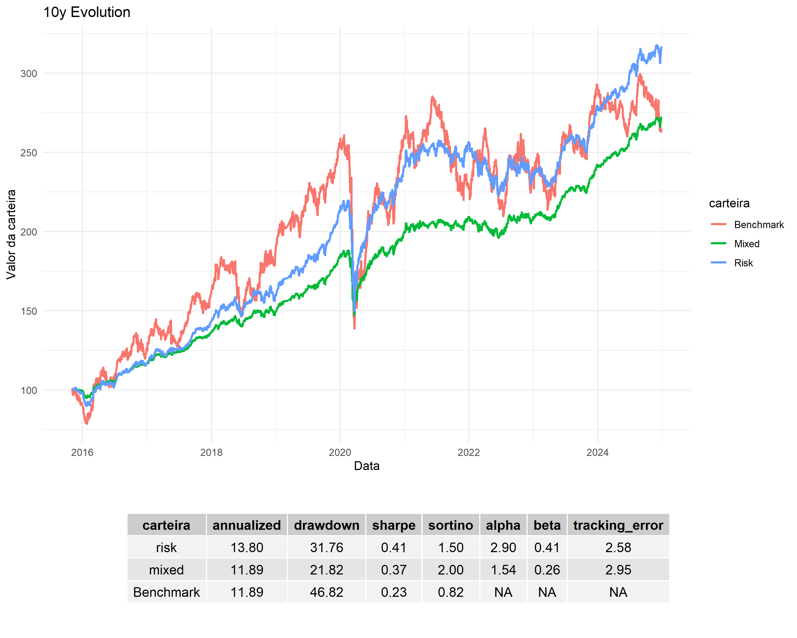
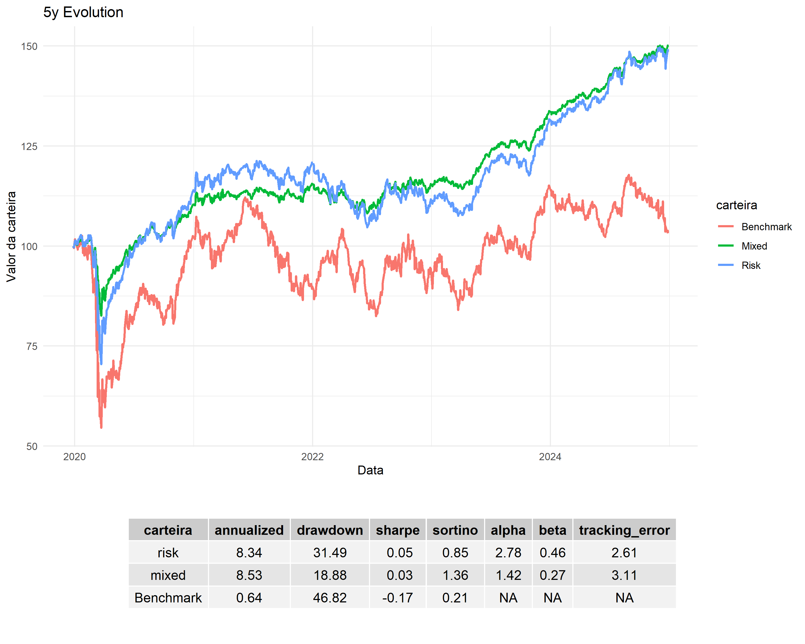
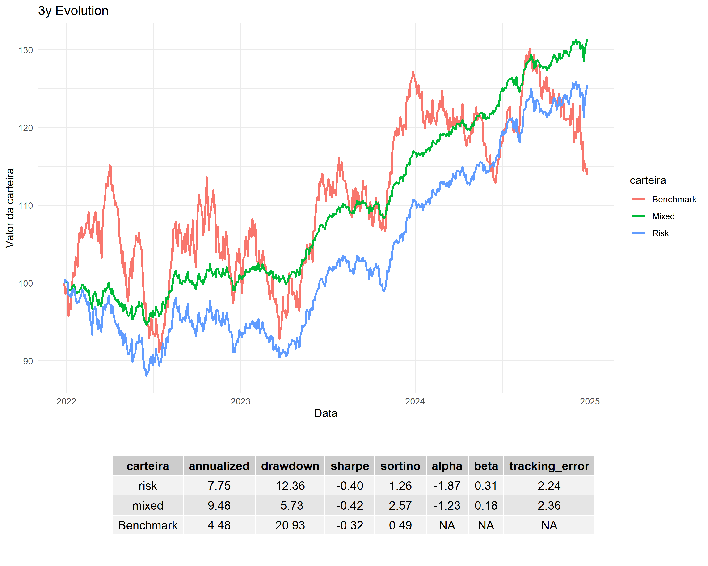

# ETF Correlation & Portfolio Efficiency Analysis 🇧🇷📊

This project explores **portfolio construction and performance analysis** using Brazilian ETFs — combining Python, R, and Business Intelligence tools, with support from Microsoft Copilot.

---

## 🎯 Project Overview
The goal is to simplify investment strategies using accessible, representative assets from the Brazilian market:

- **BOVA11** → Brazilian equities  
- **IVVB11** → U.S. equities (USD exposure)  
- **FII** → Real estate funds (combined from IFIX and XFIX11)  

We simulate portfolios across three timeframes: **10, 5, and 3 years**, comparing them to:

- **IBOVESPA (benchmark)**  
- **60/40 portfolio** → 60% efficient portfolio + 40% LFT (risk-free asset)  

---

## 🧠 Technical Highlights
- Data collection and normalization from multiple sources (ETFs, IFIX, Selic)  
- LFT simulation based on daily Selic rates  
- Efficient frontier modeling using Sharpe Ratio optimization (**Python**)  
- Equal-weight portfolio simulation with advanced metrics (**R**)  
- Advanced metrics: annualized return, max drawdown, Sharpe, Sortino, alpha, beta, tracking error  
- Modular code structure for reuse and scalability  
- Visual outputs: cumulative returns, portfolio metrics, and weight distributions  

---

## 📊 Key Results

### 10 Years


### 5 Years


### 3 Years


Each panel shows **Risk vs Mixed vs Benchmark portfolios**, with metrics such as annualized return, drawdown, Sharpe, Sortino, alpha, beta, and tracking error.

---

## 📂 Repository Structure
```etf-correlation-analysis 
    ├── pycache/ # Python execution cache 
    ├── dashboard/ # main outputs and charts 
    ├── data/ # processed datasets 
    ├── data_sources/ # original sources (e.g., IFIX snapshot) 
    ├── notebooks/ # Jupyter notebooks (Python) 
    ├── scripts/ # Python scripts (data loader, simulator, etc.) 
    ├── visuals/ # additional images and charts 
    ├── R/ # R implementation 
    │ ├── dashboard/ # outputs and charts generated in R 
    │ ├── data_sources/ # data sources used in R 
    │ ├── notebook/ # RMarkdown or exploratory scripts 
    │ └── scripts/ # R scripts (rebalancing, metrics, visualization) 
    └── README.md
```
---

## 🧑‍💻 Implementation Notes
- The **efficient portfolio modeling** (efficient frontier, Sharpe optimization) was implemented in **Python**  
- The **equal-weight portfolio with advanced metrics** (annualized return, drawdown, Sharpe, Sortino, alpha, beta, tracking error) was implemented in **R**  

---

## 🚀 Next Steps
- Visualize results in **Power BI** for interactive dashboards and storytelling  
- Expand dataset coverage (e.g., more ETFs, macro indicators)  
- Explore scenario analysis and stress testing  

---

## ⚠️ Disclaimer
The results presented are based on **historical simulations** using ETFs and Selic data.  
They **do not represent actual investment returns** and exclude transaction costs, fund fees, and taxes.  
The purpose is educational: to compare portfolio strategies and illustrate risk/return trade‑offs.

---

## 🔗 LinkedIn Post
Check out the project summary and visuals on [LinkedIn Profile](https://www.linkedin.com/in/conrado-ara%C3%BAjo-travassos-5bbb87167/)

---

## 🤝 Contributions & Feedback
Open to suggestions, collaborations, and feedback — feel free to reach out or fork the repo!